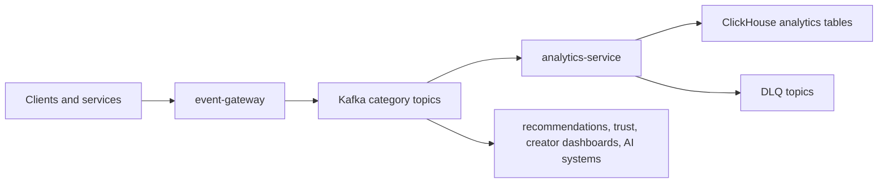

# NEXT Event Architecture

Phase 5 implements the Data + Event Layer from the NEXT Constitution (§3, §5, §6, §11). The event bus is the nervous system for analytics, recommendations, ranking, trust and safety, creator dashboards, experimentation, and future AI systems.

## Boundary

- `event-gateway` receives and authenticates event producers, validates envelopes, enriches privacy-safe metadata, and publishes to Kafka.
- `@next/events` is the shared TypeScript contract package for event types, Zod schemas, topic routing, producer helpers, consumer helpers, fixtures, and schema-registry metadata.
- `analytics-service` consumes category topics, validates envelopes again, writes ClickHouse analytics records, and DLQs poison records.

## Envelope

Every event uses the canonical envelope:

- `event_id`
- `event_type`
- `event_version`
- `event_category`
- `producer`
- `timestamp`
- nullable actor/entity IDs
- `request_id`
- `correlation_id`
- `idempotency_key`
- `payload`
- privacy-safe `metadata`

Raw IP addresses, precise location, full user agents, passwords, tokens, private messages, and payment secrets are rejected before publish.

## Flow

## Reliability

- At-least-once delivery.
- Idempotency by `idempotency_key` at ingress and `event_id` in ClickHouse `ReplacingMergeTree` tables.
- Partition ordering by the most specific aggregate key available.
- Retry before DLQ for ClickHouse writes.
- Replay by topic, partition, offset, or timestamp.
